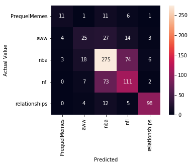
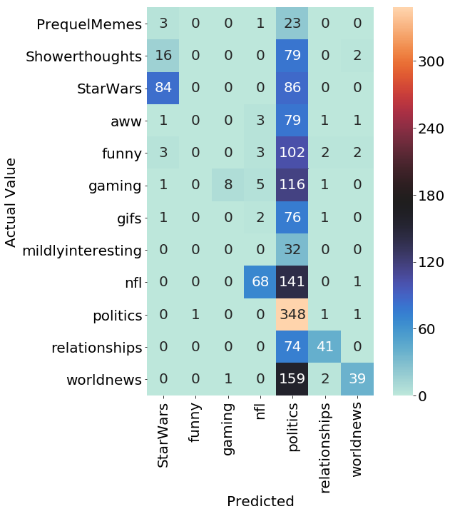
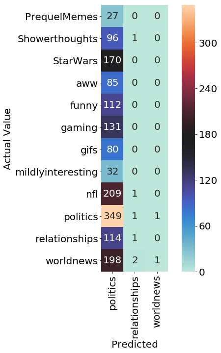
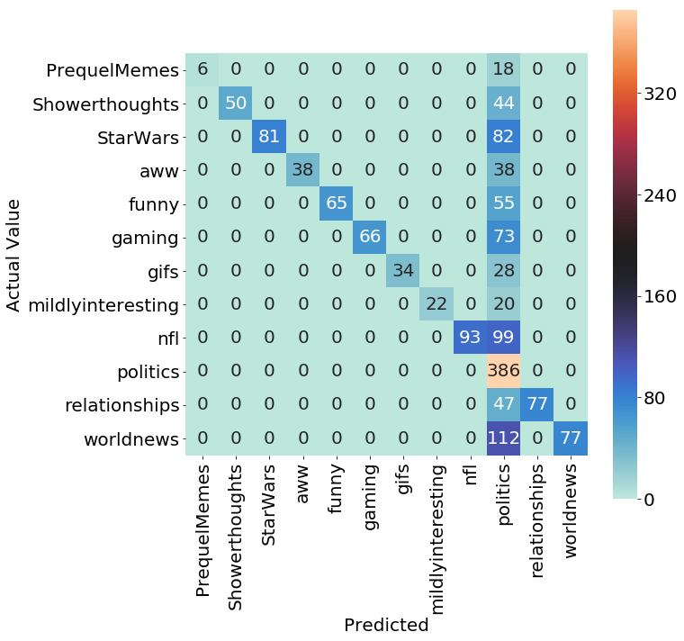
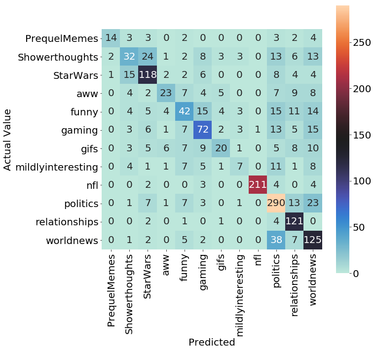
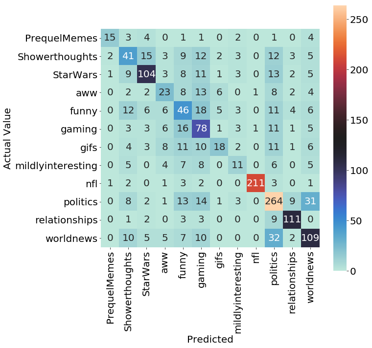

# Final Report

## Name : Matthew Borbonus
## Username : MJB288
## Date : 4/26/19

My project was a rather interesting one. First off, there was the issue of the corpus size. I initially wanted one month in size, but that was 40 GB uncompressed in size, much bigger than my RAM total's. While I knew it was possible that it could be processed in chunks, I also knew that not being able to have the whole Corpus in memory would slow me down. So I downsized the corpus to one day which was 2 GB uncompressed. Which was much better. With that out of the way, I was able to move onto cleaning the data, removing columns that I was either not interested in or did not seem important. 

The corpus is from December 21, 2017. The data has multiple columns. The ones I ended up using, interacting with:

* subreddit - the name of the subreddit
* score - the total upvote/downvote count on a comment
* cakeday - anniversary of when user signed up - represented as a boolean for the particular day
* parent_id - the id of the submission or original post that the comment falls under
* body - the textual content of the comment
* author flairs - css and text - represents the decoration and name of flairs - or subreddit specific titles
* controversiality - don't particularly understand this one, but it represents the controversialness of the post as a boolean.

I did endure one major setback though. All of my progress on phase 1 of the project was mostly for naught. [This](https://nbviewer.jupyter.org/github/Data-Science-for-Linguists-2019/Reddit-Comment-Analysis/blob/master/legacy_notebooks/project-explore.ipynb#corpus) for-loop/function is what I used to originally read in the 40 GB corpus size. Well, I switched corpus size last minute, but I kept using that function which was a very impractical way to do it (not to mention I was appending directly to a data frame which I found out later was incredibly slow). All of my data processing was for nothing as I did data cleanup for only one subreddit, not the entire data set. This is why I redid the data cleanup on phase 2 that I also did on phase 1. This is a more minor setback, but I published by first data sample incorrectly as well. I made the mistake of arranging it by hand with extremes and the middle of the data, instead of using the sample function for dataframes. Overall, phase 1 was the least productive of all the phases because none of the results ended up getting used. It is tied with this phase for productivity since I was unable to do much for this round.

In phase 2 I corrected these errors by [loading in the data directly with pd.read_json](https://nbviewer.jupyter.org/github/Data-Science-for-Linguists-2019/Reddit-Comment-Analysis/blob/master/legacy_notebooks/phase2_exploration.ipynb#dataacq). I could not expand upon this further with another day because I wanted the ability to work on the project on the go, and loading one day size of data would nearly max out my data. Moving on, after the cleaning up the data, I published a correct sample using the sample function instead of making the same mistake again. Thank you for directing me to the sample function.

I filtered my data to a total score value of 50 or greater because, it's an internet for

I used two models in my machine learning project, Naive Bayes and Support Vectors. I wanted to use more, but I was strapped for time. I did some [preliminary machine learning](https://nbviewer.jupyter.org/github/Data-Science-for-Linguists-2019/Reddit-Comment-Analysis/blob/master/legacy_notebooks/phase2_exploration.ipynb#machinelearn) to establish some baselines and to get an idea of what I was up against. I established a baseline accuracy of 11% against the whole corpus. I explore some subset of subreddits later to experiment with said groups, getting a feel for what subreddits to use to fine tune the models. Support vectors was superior to Naive Bayes in the trials where they were both run. This was not really surprising however. Here is an example heatmap of one combination of subreddits:

 

For phase 3, I settled upon 14 subreddits to fine tune my model settings to re-apply to the whole corpus. This list included the following subreddits: relationships, aww, nfl, PrequelMemes, gaming, mildlyinteresting, politics, Showerthoughts, worldnews, gifs, StarWars, and funny. I wanted to use AskReddit, but as I saw in the [phase 2 basic stats section](https://nbviewer.jupyter.org/github/Data-Science-for-Linguists-2019/Reddit-Comment-Analysis/blob/master/legacy_notebooks/phase2_exploration.ipynb#stats), AskReddit has a severe disproportionate amount of data (6735 samples with the filter, 2nd place is ), and I know from offhand experience that many topics are discussed there, so selecting that subreddit would have made finding routes to optimize my models difficult. Nonetheless, I wanted some subreddit to be disproportional to the rest, so I selected politics, which was number 3 on that list (with 1786 samples), but less disproportional than AskReddit. The rest of the subreddits appear among the top  list of subreddit frequency except for PrequelMemes. Initially, it was mostly out of bias, I enjoy that subreddit a lot. But I realized, that having a slightly smaller subreddit than the rest of the subreddits might give me an idea if the model would struggle to classify smaller subreddits naturally.

Moving on, I established the baseline accuracy for the classifier ([code here](https://nbviewer.jupyter.org/github/Data-Science-for-Linguists-2019/Reddit-Comment-Analysis/blob/master/legacy_notebooks/phase3progress.ipynb#baseline)), which should be the largest data portion. As I mentioned, this would be politics who makes up 22% of the data. Starting off with minimal settings, I landed 36% for Naive Bayes and 48% with support vectors with no fine tuning. Here are their confusion matrices in their respective order:

 

As you can see from the confusion matrices, Naive Bayes at baseline could not identify whole subreddits at this phase while support vectors could identify at least three of each subreddit correctly.

To fine tune the models even further, I decided to use CRC to run grid search. The exact paramaters I tested using the grid search can be found [here](https://nbviewer.jupyter.org/github/Data-Science-for-Linguists-2019/Reddit-Comment-Analysis/blob/master/legacy_notebooks/phase3progress.ipynb#optimal). I was overzealous in testing support vectors and could not get the grid search to run properly. I used the Tfidf features found in the Multinomial part of the grid search, and ran grid search on just the support vector unique parameters locally. Further in the section I linked, you can find that the Multinomial Naive Bayes got a higher accuracy score than Support Vectors on both cross-validation and one singular run. Results:
* Multinomial Naive Bays : 58% Single, 54% 5 fold Cross Validation
* Support Vectors: 52% Single, 48% 5 fold Cross Validation

I then [tried additional features](https://nbviewer.jupyter.org/github/Data-Science-for-Linguists-2019/Reddit-Comment-Analysis/blob/master/legacy_notebooks/phase3progress.ipynb#features). First I tried using numerical values like the karma score and controversiality (since it's represented as a boolean numerically). This ended up disastrously, as it went below the 22% accuracy by about .3% or so. Here's the confusion matrix for a good laugh:

I then peeked at the parent ID column to see how much of a cheat it would be to use:

As you can see, it correctly classifies all parent ID's it has seen, and then defaults to politics when it doesn't find one. Therefore, it cannot be used, does not present any challenge and defeats the purpose of the classifier.
Onwards, I then tried score with the textual features - this ended up leading to a downgrade of accuracy from our orevious best of 58% to 53%, which is not good. I then tried author flairs with the text. This produced the best run I have. The results on both machine learning algorithms:

* Multinomial Naive Bayes: 67% singular, 62% 5 fold cross-validation
* Support Vectors: 64% singular, 57% 5 fold cross-validation

Here are the respective confusion matrices:

As you can see - Support Vectors misclassifies as politics less than Multinomial Naive Bayes, but it misclassifies the other subreddits more often, which is where the decrease in accuracy shows. 

I was unable to do much after reaching this point due to other responsibilities, but I did give truncated SVD to try feature reduction methods. It cannot be used with Naive Bayes since Naive Bayes does not work with negative numbers and Truncated SVD produces features with negative values. Thus I could only do it with support vectors. I do not know if I was using it incorrectly, or if it was not well suited to the task.